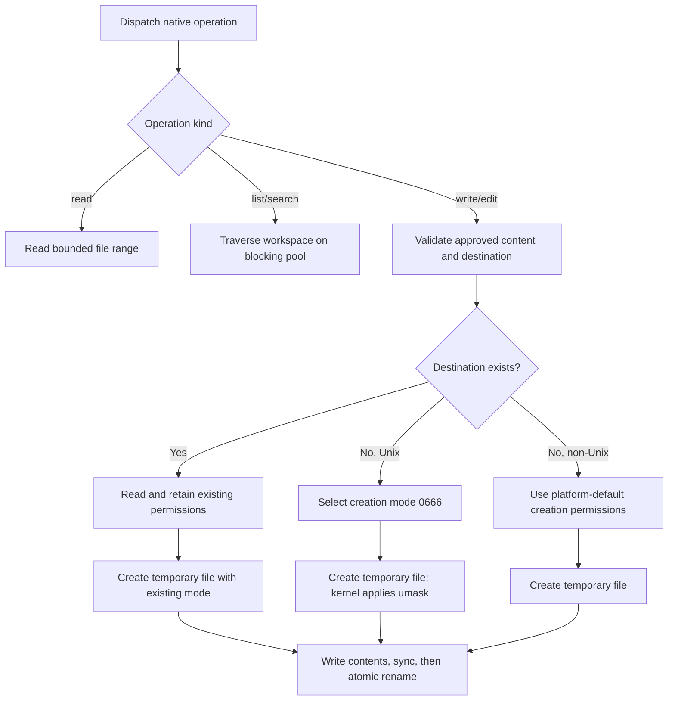

# Agent implementation specification

## Crate boundaries

| Crate | Responsibility |
| --- | --- |
| `agent-core` | Typed ports, events, session model and service composition kernel |
| `agent-runtime` | Standard loop, HTTP/SSE, native tools, SQLite, instructions and MCP |
| `cortex-agent` | Configuration, composition root, terminal approvals and CLI |

The runtime depends on the core; the CLI depends on both. None depends on Rook.
Ports use async traits and typed errors. ModelProvider yields a stream of deltas;
AgentLoop accepts a session, prompt, approval policy, event sink and cancellation
token. The standard loop is registered through LoopService, so another native
implementation can replace it without changing the supervisor.

## Services and effects

Services use explicit `name@major` identifiers, one provider per service and one
scope. Plugins declare provided and required services. Activation resolves only
declared dependencies, stages registrations, verifies the manifest and publishes
atomically. Failed activation cancels owned tasks and discards staged registrations.
Missing dependencies block; ambiguity and cycles fail explicitly. Removal stops
transitive consumers before their provider. Cleanup and deactivation have deadlines;
diagnostics preserve generation, state and errors. Native plugins are trusted and
must register owned tasks through PluginContext. Hot reload and a public SDK are
outside this contract.

Tools expose definitions, prepare a payload and optional approval preview, then
execute. The loop persists the assistant tool call before execution and persists
approval outcomes before effects. Calls execute sequentially. Permission policy
runs outside model/provider code and cannot be changed by repository text. The
interactive terminal prints the complete approval action and preview without
truncating diffs, then requests a one-time yes/no answer; explicit `--allow`
grants apply only to that CLI invocation. Approval previews must identify the
target/location, requested change or arguments, and relevant external-effect or
sandboxing risk. MCP tool previews identify the server and remote tool, show the
arguments sent, and warn that effects depend on the server; MCP startup previews
identify command, arguments, working directory, environment names, host privileges
and lack of sandboxing. Native effect denial must occur before mutation.
The terminal's exact action grants last only for the current invocation.

The terminal policy numbers each approval within a turn. The header reads
`Approval for <action> (request #N this turn[, different from #<N-1>]):`,
followed by a single `Action: <action>` line and, when the preview starts with a
known prefix, a single `Effect: <one-line summary>` line above the full
preview. The counter resets to 0 at the start of each new turn so each turn's
approvals number from #1 again. The prompt text is
`Approve this exact change? [y/N]`.

The chat loop also accepts `/compact` (with `/summarize` as a deprecated
alias) to trigger the same real-model summarization the conservative
byte-budget threshold would call. The CLI prints
`Compact session now? Older history will be summarized; originals stay in the
database. [y/N]` and reuses the same `Input` reader used for approvals; on
`y` it calls `StandardLoop::compact(session, sink, cancel)`, which mirrors the
summary branch of the loop's `context()` method (same prompt, same
`max_tokens = 1024`, same `Event::Compacted` emission, same SQLite save) and
returns the loop to the prompt. The automatic path is unchanged: the
threshold still triggers compaction without user action.

## HTTP and event contract

OpenAI-compatible Chat Completions POSTs to `base_url/chat/completions` with tools,
streaming and usage enabled. Requests use rustls, configured deadlines and no
redirects. URLs cannot embed credentials, query strings or fragments. Errors omit
provider response bodies and credential values. SSE parsing supports fragmented
UTF-8 and function arguments. Tools are dispatched only after a valid finish marker
and complete object arguments. Invalid or truncated streams fail the turn.

JSON events use a `type` discriminator: turn_started, text, tool_started,
approval_requested, approval_resolved, tool_finished, usage, compacted,
turn_finished and error. Event variants and fields are defined in agent-core.
Text is incremental; approval and tool events include their identifiers.
Text deltas are emitted directly to the live sink, not appended to persisted events.

## Persistence and context

SQLite schema version 1 uses `sessions(id TEXT PRIMARY KEY, data TEXT NOT NULL,
updated_at TEXT NOT NULL DEFAULT CURRENT_TIMESTAMP)`. `data` is a serialized Session
with original messages, events, workspace, separate summary and exclusive summary
boundary. Each update is an atomic UPSERT. Future migrations must be explicit;
unknown higher user_version values are rejected. Cross-process advisory lock files
protect an actively resumed session and release automatically after a crash.

Completed assistant responses are saved as messages before any tool execution;
resume and context assembly use those messages, not replayed text events. Text
delta count does not increase session saves. Partial text from incomplete, failed,
cancelled or crashed turns is live-only and intentionally lost on reload. Existing
stored text events remain readable; new streams do not persist them. Usage,
turn/error, compaction, tool and approval persistence boundaries are unchanged,
including saving approval outcomes before effects and tool results after execution.

An unfinished tool call is paired with an unknown-completion recovery result rather
than replayed. Stored summaries must end on a user-turn boundary. Context assembly
includes current instructions, the summary and unsummarized original messages.
At 80% of the conservative budget, older complete turns are summarized by the same
provider with tools disabled. The last two user turns remain verbatim. Summary
failure or overflow stops with original history intact. Serialized byte counts,
including tool definitions and output reservation, are conservative token estimates.

## Native and MCP limits

- UTF-8 file reads and writes: 1 MiB per file; complete approval diffs: 64 KiB.
- Tool output: 64 KiB with a visible truncation marker; search: 100 matches.
- File listing: 100 entries with a visible limit marker; select a narrower path for more.
- Traversal: 20,000 entries, skipping generated/dependency folders and directory symlinks.
- Read tools resolve containment; new writes require an existing contained parent.
- Writes compare prepared paths and original content, then use a temporary file and
  atomic rename. On Unix, existing destination permissions are read before opening
  the temporary file and used as its creation mode; new files use mode `0666`, allowing
  the kernel to apply the process umask. Non-Unix creation behavior follows platform
  defaults. Concurrent hostile filesystem mutations are outside the trust model.
- Native tool execution dispatches each operation to a focused handler to keep the
  orchestration path readable; blocking workspace traversal runs on Tokio's blocking pool.

- Shell uses POSIX sh, null stdin, PATH-only environment and supervised process groups.
  Timeout, cancellation and dropped execution kill the group; stdout/stderr are drained
  with bounded retained output. Nonzero exit status is returned to the model.
- SSE events: 1 MiB; at most 64 calls, each argument string at most 256 KiB.
- Instructions: 64 KiB per document and 128 KiB combined, reloaded each iteration.
- MCP uses official rmcp 3.5.1, pinned for Rust 1.89, local stdio only.
- MCP discovery: 128 tools per server, 16 KiB per schema. Names are
  `mcp_SERVER_INDEX`; approval identity includes the remote tool name.
- MCP launch uses only configured literal environment values and named env_from
  sources. Startup and each call need approval. SDK transport closure and process
  groups bound teardown; failed or timed-out calls may have unknown external effects.

## Acceptance evidence

Separate deterministic tests exercise kernel lifecycle/rollback, edit approval and
stale diffs, shell execution and descendant cleanup, path containment, interruption
and resume, scoped instructions, compaction, HTTP and MCP transports, and CLI JSON.
Public endpoints and Rook have not been asserted compatible. macOS deterministic
checks do not establish Linux daily-use acceptance. Record full gate results in
[validation](validation.md); real-model and Linux checks remain manual acceptance.
