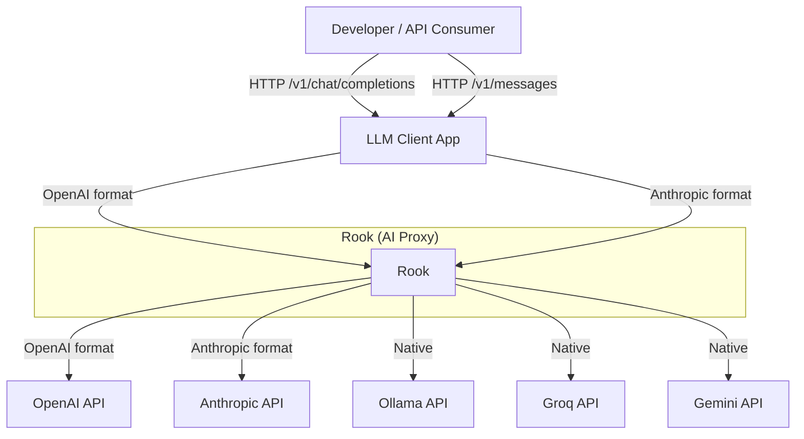
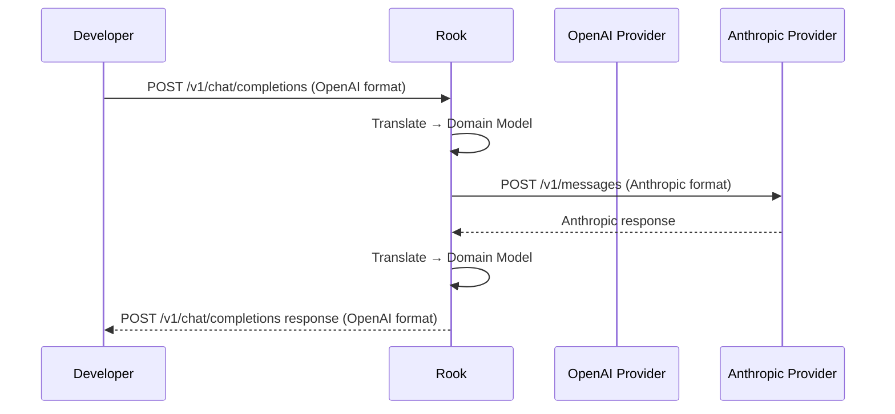
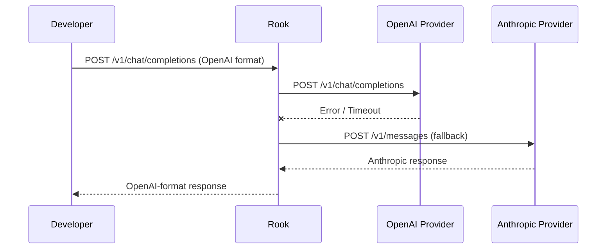

# C1 — Context Diagram

**Level:** Context (L0 — What is Rook and what does it connect to)

**Purpose:** Show the high-level boundaries, external actors, and data flows without revealing internal structure.

---

## System Boundary



## External Actors

| Actor | Type | Description |
|-------|------|-------------|
| Developer / API Consumer | Person | Sends LLM requests via OpenAI or Anthropic wire format |
| LLM Client App | Software System | Application consuming Rook's API (curl, SDK, etc.) |

## External Systems (Providers)

| Provider | Protocol | Auth |
|----------|----------|------|
| OpenAI | OpenAI `/v1/chat/completions` | API Key |
| Anthropic | Anthropic `/v1/messages` | API Key |
| Ollama | Ollama native | None (local) |
| Groq | Groq native | API Key |
| Gemini | Gemini native | API Key |

## Trust Boundaries

```
┌─────────────────────────────────────┐
│          TRUSTED: Rook              │  ← request routing, caching, audit
│                                     │
│  ┌───────────────────────────────┐  │
│  │  UNTRUSTED: External          │  │  ← provider responses
│  │  Providers & Clients           │  │
│  └───────────────────────────────┘  │
└─────────────────────────────────────┘
```

---

## Key Interactions

### 1. OpenAI-format request routed to Anthropic provider



### 2. Request with fallback on provider failure



---

## Capabilities (C1 Scope)

| Capability | Description |
|------------|-------------|
| Request Routing | Route LLM requests to the appropriate provider based on model |
| Format Translation | Translate between OpenAI and Anthropic wire formats via domain pivot |
| Fallback | Automatically try next provider when one fails |
| Caching | Cache responses to avoid redundant provider calls |
| Audit Logging | Record all requests and responses for debugging |

**Out of scope for C1**: internal crate structure, database schema, encryption details.

---

## Evolution Notes

This diagram will be updated as:
- New providers are added (e.g., Mistral, Cohere)
- New client formats are supported (e.g., Gemini format, LiteLLM)
- Authentication mechanisms change (e.g., API key management, OAuth)
