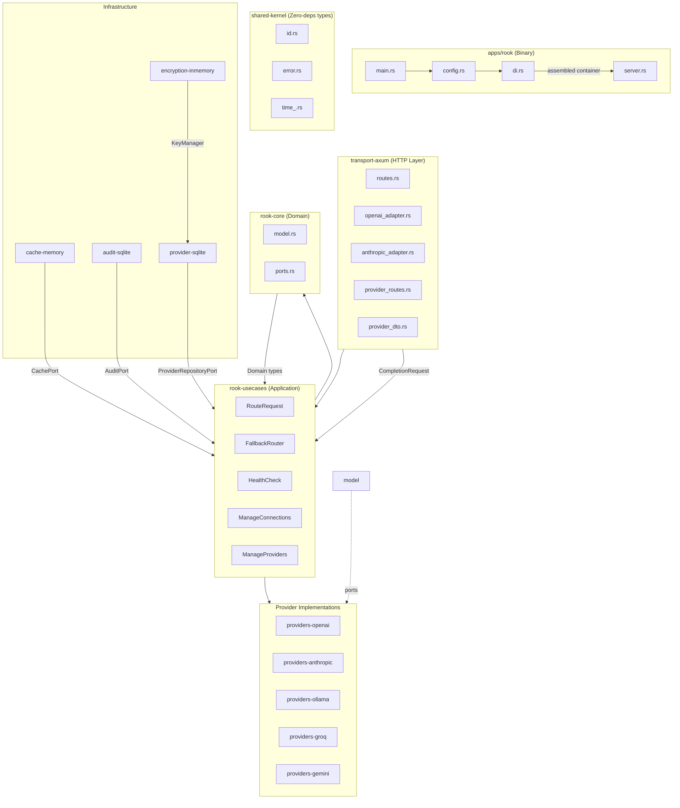
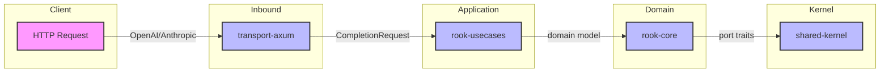
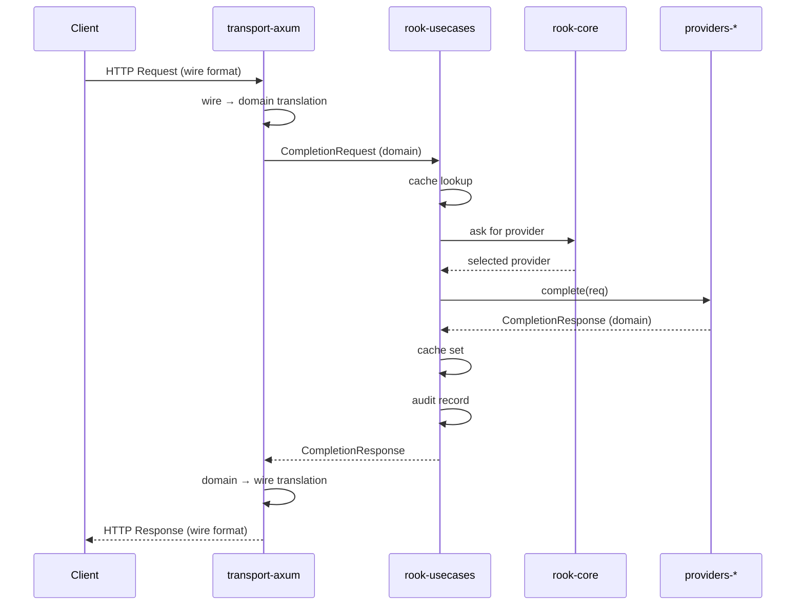

# C2 — Container Diagram

**Level:** Container (L1 — Major building blocks and how they communicate)

**Purpose:** Show the internal crates (containers) of Rook and how data flows between them.

---

## Crate Overview



---

## Crate Responsibilities

| Crate | Responsibility | Public API |
|-------|----------------|------------|
| `apps/rook` | Binary — main entry, config loading, DI assembly | None (binary) |
| `transport-axum` | HTTP server, wire format ↔ domain translation | `router()`, adapter funcs |
| `rook-usecases` | Request orchestration, routing, health checks | `RouteRequest`, `FallbackRouter`, traits |
| `rook-core` | Domain model + port traits (interfaces) | `CompletionRequest`, `ProviderPort`, traits |
| `shared-kernel` | Zero-deps ID types, error types | `ProviderId`, `ModelId`, `CortexError` |
| `providers-*` | Per-provider LLM API implementation | `ProviderPort` impl |
| `cache-memory` | In-memory TTL cache | `CachePort` impl |
| `audit-sqlite` | SQLite audit log | `AuditPort` impl |
| `encryption-inmemory` | AES-256-GCM encryption | `KeyManager` impl |
| `provider-sqlite` | SQLite provider repository | `ProviderRepositoryPort` impl |

---

## Inter-Crate Communication



## Key Ports (Interfaces)

```
┌──────────────────────────────────┐
│      rook-usecases              │
│  (Depend-on-abstractions)       │
└──────┬───────────────────────────┘
       │ implements
┌──────▼───────────────────────────┐
│      rook-core ports.rs          │
│  ProviderPort, RouterPort,       │
│  CachePort, AuditPort,          │
│  ProviderRepositoryPort,         │
│  KeyManager                      │
└──────────────────────────────────┘
       │ used by
┌──────▼───────────────────────────┐
│      Infrastructure impls        │
│  providers-*, cache-memory,      │
│  audit-sqlite, encryption-*,     │
│  provider-sqlite                │
└──────────────────────────────────┘
```

---

## Data Flow (C2 Level)



---

## Boundary Notes

**Out of scope for C2:**
- Internal struct details (RouteRequest fields, FallbackRouter state)
- Database schema details (SQL in audit-sqlite, provider-sqlite)
- Encryption algorithm specifics
- Dashboard Vue.js app (apps/rook/dashboard/)

**Known limitations:**
- Provider CRUD does NOT hot-register providers into the router (see architecture.md)
- Ollama provider uses Ollama native format, not OpenAI compatibility layer
- Streaming implemented only for OpenAI provider (Phase 2 for others)

---

## Evolution Notes

This diagram will be updated as:
- New provider crates are added
- Infrastructure crates change (e.g., replace SQLite with Postgres)
- New usecases are added (e.g., batch processing, prompt templates)
- Portraits change (e.g., new `MetricsPort` for observability)
