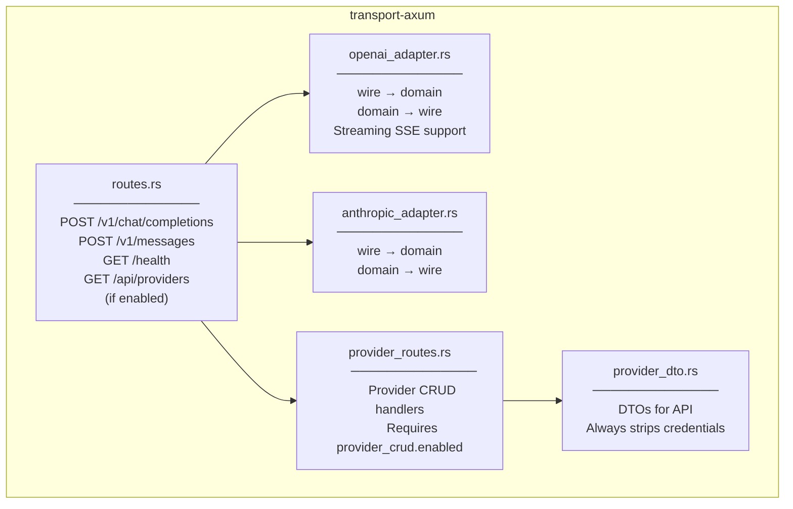
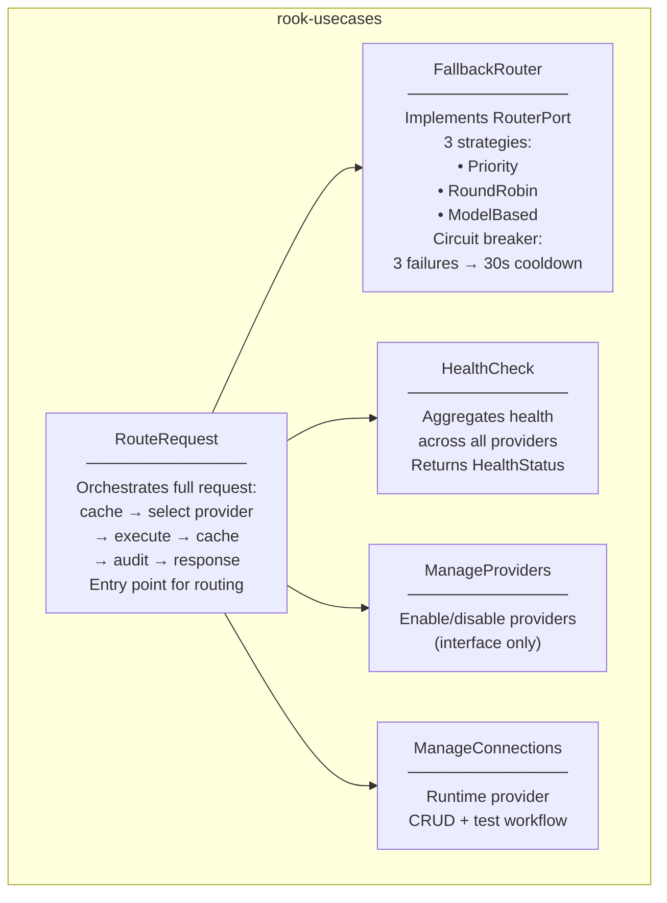
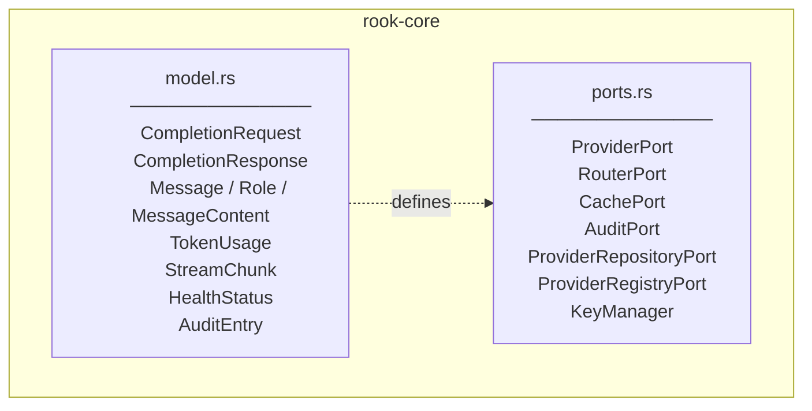
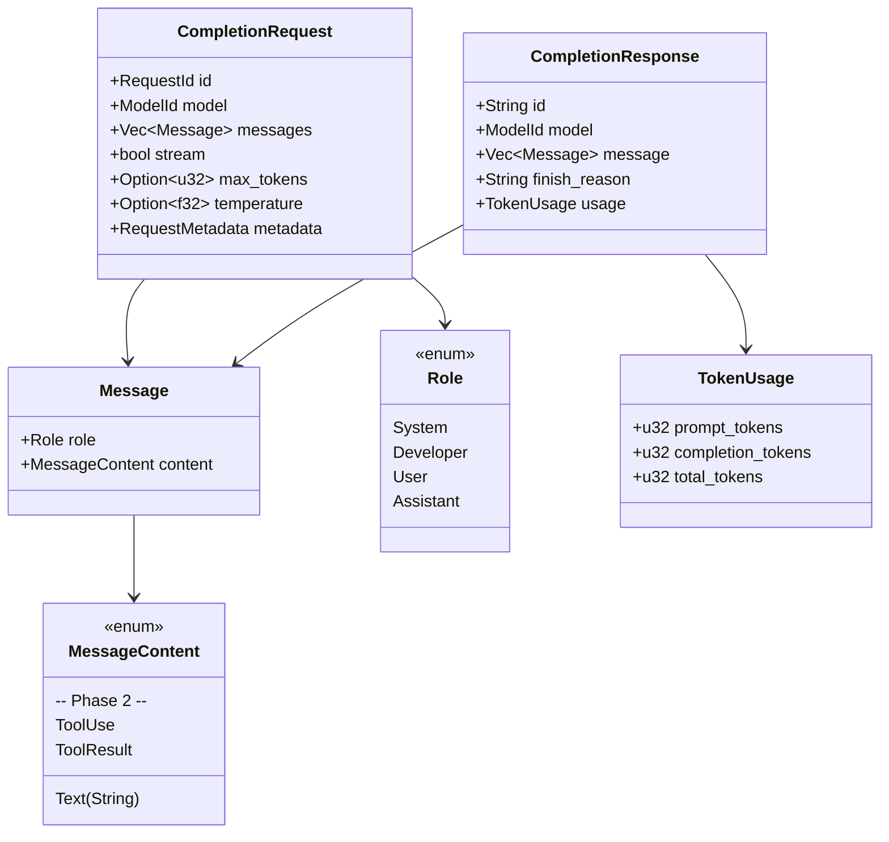
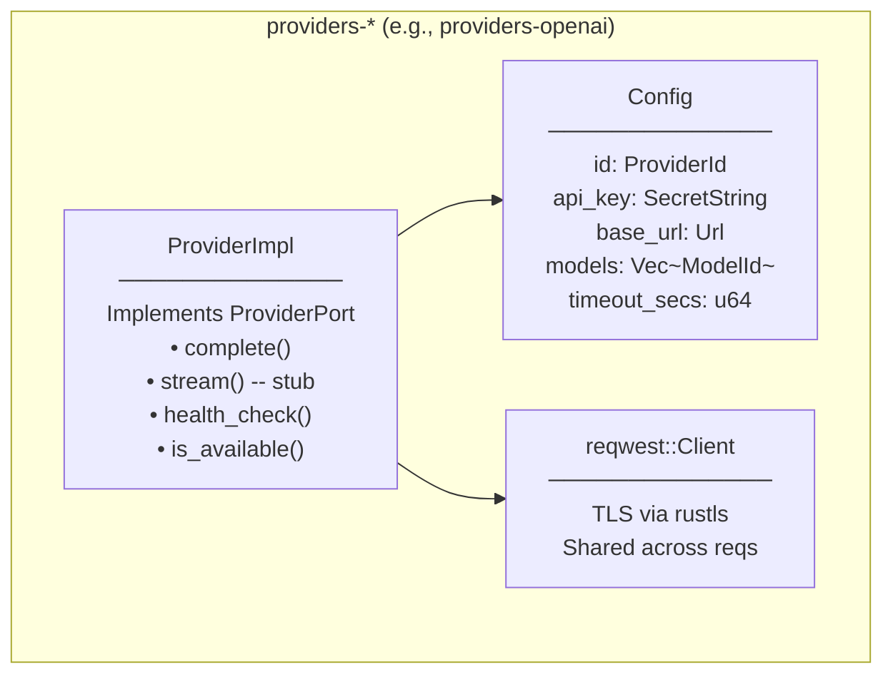
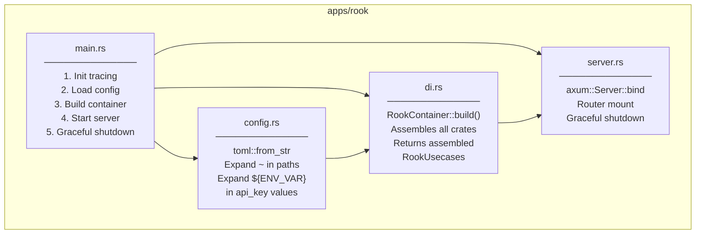
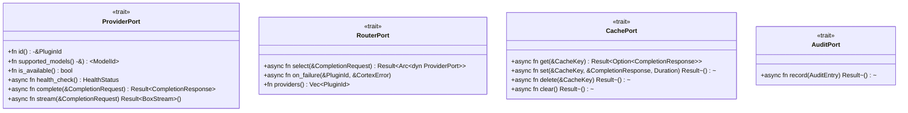

# C3 — Component Diagram

**Level:** Component (L2 — What lives inside each major crate)

**Purpose:** Show the key components inside the most important crates and how they relate at a finer grain than C2.

---

## `transport-axum` Components

| Component              | Responsibility                                          |
|------------------------|---------------------------------------------------------|
| `routes.rs`            | Axum router setup, endpoint mounting, request dispatch  |
| `openai_adapter.rs`    | OpenAI `/v1/chat/completions` wire ↔ domain translation |
| `anthropic_adapter.rs` | Anthropic `/v1/messages` wire ↔ domain translation      |
| `provider_routes.rs`   | CRUD endpoints for runtime provider management          |
| `provider_dto.rs`      | Data transfer objects (request/response serialization)  |

---

## `rook-usecases` Components

| Component           | Responsibility                                                                                     |
|---------------------|----------------------------------------------------------------------------------------------------|
| `RouteRequest`      | Main orchestrator: hit cache → select provider → execute → cache response → audit → handle failure |
| `FallbackRouter`    | Implements `RouterPort` with Priority/RoundRobin/ModelBased strategies + circuit breaker           |
| `HealthCheck`       | Aggregated health status from all registered providers                                             |
| `ManageProviders`   | Enable/disable providers (interface only for now)                                                  |
| `ManageConnections` | Runtime provider connection CRUD and test workflow                                                 |

---

## `rook-core` Components

| Component  | Responsibility                                                                                          |
|------------|---------------------------------------------------------------------------------------------------------|
| `model.rs` | Domain types — completely provider-agnostic. No wire format knowledge.                                  |
| `ports.rs` | Trait definitions for infrastructure dependencies. "What" the domain needs, not "how" it's implemented. |

### Domain Model Detail

---

## `providers-*` Components (Common Pattern)

All provider crates follow the same structure:

| Method           | OpenAI | Anthropic | Ollama | Groq | Gemini |
|------------------|--------|-----------|--------|------|--------|
| `complete()`     | ✅      | ✅         | ✅      | ✅    | ✅      |
| `stream()`       | stub   | stub      | stub   | stub | stub   |
| `health_check()` | ✅      | ✅         | ✅      | ✅    | ✅      |
| `is_available()` | ✅      | ✅         | ✅      | ✅    | ✅      |

---

## `apps/rook` Components

---

## Key Trait Definitions

---

## Out of Scope for C3

- **Database internals**: specific SQL schemas for audit-sqlite and provider-sqlite
- **Encryption details**: AES-256-GCM parameters, Argon2id rounds
- **Dashboard Vue.js app**: lives in `apps/rook/dashboard/`, separate frontend concern
- **`tmp/OmniRoute`**: experimental/transient code, not production

---

## Evolution Notes

This diagram will be updated as:

- Phase 2 components are added (`SseBuffer`, tool call support)
- `streaming()` methods are implemented across providers
- New ports/traits are introduced (e.g., `MetricsPort`, `RateLimitPort`)
- `ManageConnections` gains full CRUD implementation
